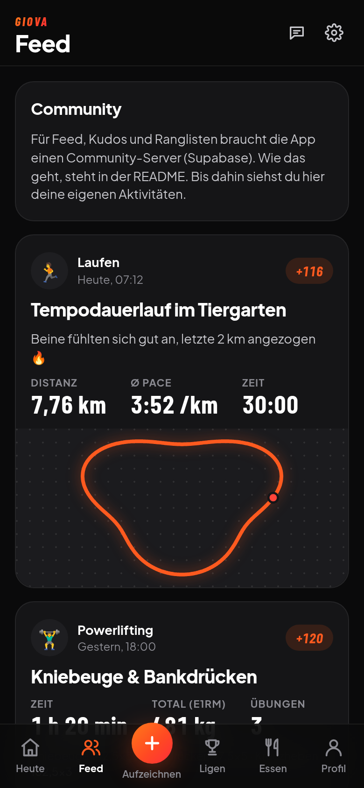
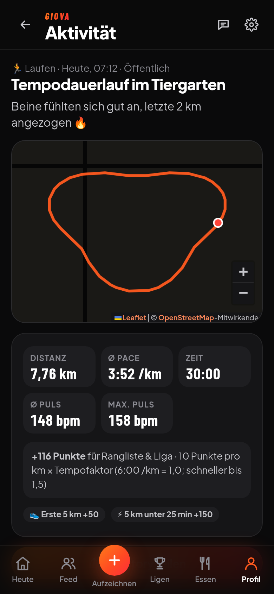
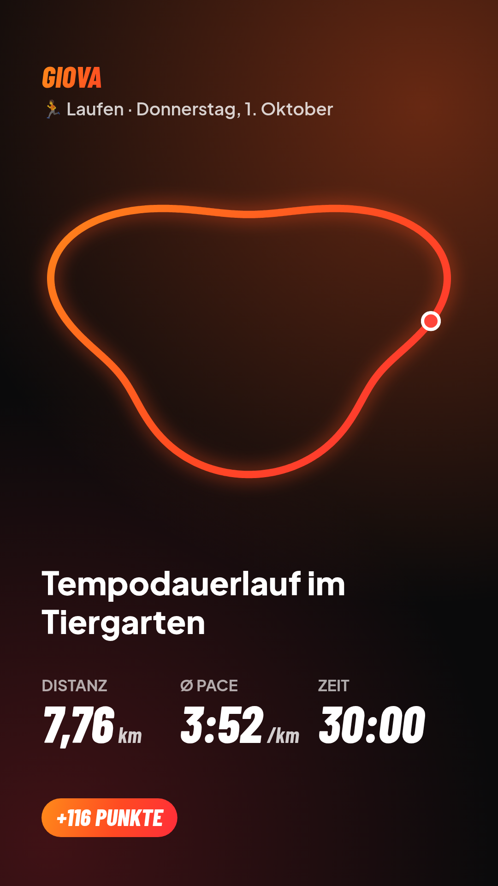
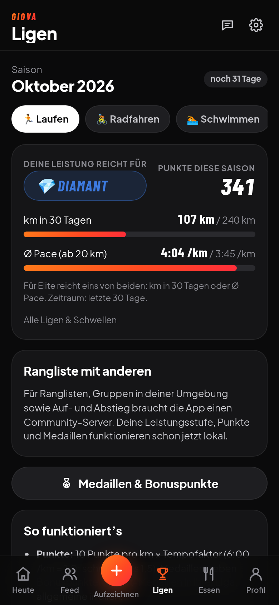

# Giova Fit

Plattform für Sportarten, die man meistens allein macht – **Laufen, Radfahren, Schwimmen, Wandern, Rudern, Hyrox, Gym und Powerlifting**. Du zeichnest Einheiten auf oder übernimmst sie von deiner Uhr, teilst sie mit Freunden, sammelst Punkte und Medaillen und trittst in **Ligen mit Auf- und Abstieg** gegen Leute mit ähnlichem Niveau aus deiner Umgebung an. Dazu kommen Kalorientracker, Schlaf, Ziele und ein **KI-Ernährungsplan** (Claude Sonnet 5.5), der sich nach deinem Trainingsplan und deinem Alltag richtet.

Die App läuft als Web-App (PWA) im Browser und lässt sich auf dem Handy wie eine App installieren.

<p>
  
  
  
  
</p>

Design: dunkel mit Orange-Rot-Verlauf, sportliche Schriften (Barlow Condensed für Zahlen, Plus Jakarta Sans für Text; beide in der App gebündelt, ohne Google-Server). Ein helles Design lässt sich unter ⚙︎ → *Darstellung* wählen.

## Funktionen

### Aufzeichnen
- **Live-Tracker mit GPS** für Laufen, Radfahren, Wandern und Rudern: Karte, Zeit, Distanz, aktuelle und durchschnittliche Pace, Auto-Pause, Kilometer-Ansage. Für Schwimmen und Hyrox läuft eine Stoppuhr. Die Aufzeichnung läuft weiter, wenn du in der App die Seite wechselst, und übersteht ein Neuladen.
- **Import von der Uhr:** FIT (Garmin-Original), GPX und TCX, auch mehrere Dateien auf einmal. Das funktioniert für Garmin, Strava, Polar, Suunto, Coros und die Apple Watch (über Export-Apps). Doppelte Aktivitäten werden erkannt.
- **Krafttraining:** Sätze wie bisher eintragen. Mit „Einheit abschließen“ wird der Tag zur Aktivität (Gym oder Powerlifting inklusive e1RM der Wettkampfübungen).
- **Manuell**, zum Beispiel für einen Hyrox-Wettkampf, eine Bahn-Einheit oder ein Laufband.
- Jede Aktivität hat eine Detailseite mit Karte, Kilometer-Splits (bzw. 100-m-Abschnitten beim Schwimmen), Puls, Höhenmetern, Foto und Punkten.
- **Als Story teilen:** Aus jeder Aktivität wird ein Bild im Story-Format (1080 × 1920) mit leuchtender Strecke und den wichtigsten Werten. Es gibt drei Hintergründe: schwarz, dein eigenes Foto oder transparent als Sticker zum Auflegen in Instagram. Das Bild geht direkt ins Teilen-Menü des Handys oder wird gespeichert.

### Community (Supabase)
- Eigenes Konto mit Profil, Profilbild, Sportarten und Region.
- **Feed** mit Aktivitäten von Leuten, denen du folgst, aus deiner Umgebung oder von allen. Dazu **Kudos**, **Kommentare**, Personensuche und Folgen.
- Sichtbarkeit pro Aktivität: *Öffentlich*, *Nur Follower* oder *Nur ich*. Auch „Nur ich“ zählt für die Liga, ist aber für niemanden sonst sichtbar.
- Datenschutz: Start und Ziel lassen sich auf der Karte ausblenden (je 200 m). Die Region wird nur als grobes Raster gespeichert (≈ 40 × 20 km). Ernährung, Schlaf und Gewicht bleiben auf deinem Gerät.

### Punkte, Ligen & Medaillen
- **Punkte je Aktivität** nach Sportart, zum Beispiel Laufen mit 10 Punkten pro km × Tempofaktor (6:00 /km = 1,0, schneller bis 1,5) und Hyrox mit 2 Punkten pro Minute (Wettkampf × 1,5). Unrealistische Werte geben 0 Punkte. Die Punkte berechnet der Server, der Client kann sie nicht manipulieren.
- **Sechs Ligen pro Sportart:** 🥉 Bronze, 🥈 Silber, 🥇 Gold, 💠 Platin, 💎 Diamant, 👑 Elite. Du wirst nach deiner Leistung der letzten 30 Tage eingestuft, entweder über den **Umfang** (z. B. km pro Monat) **oder** über das **Tempo** (z. B. Ø Pace ab 20 km). Beim Powerlifting zählt der **DOTS-Wert**, bei Hyrox die **Wettkampf-Bestzeit**.
- **Gruppen à max. 30 Personen** aus deiner Umgebung in derselben Liga. Eine Saison dauert einen Kalendermonat.
- **Aufstieg:** Top 20 % der Gruppe, oder direkt, sobald deine Leistung die Schwelle einer höheren Liga erreicht (auch mehrere Ligen auf einmal).
- **Abstieg:** untere 20 % der Gruppe, wenn du die Schwelle deiner Liga nicht hältst, oder wenn du im ganzen Monat keine Punkte sammelst. Gruppen mit weniger als 5 Personen haben keine Zonen.
- Zusätzlich gibt es **Bestenlisten** für die Umgebung (≈ 150 km) und für alle.
- **32 Medaillen für erreichte Ziele**, zum Beispiel erste 10 km, Halbmarathon, Hyrox unter 1:30 h, 2 × Körpergewicht Kreuzheben, 7 Tage Proteinziel, Zielgewicht, Kraftziel oder eine komplett umgesetzte Planwoche. Sie bringen **Bonuspunkte**: Sport-Medaillen zählen in der Liga ihrer Sportart, allgemeine in allen Ligen. Monats-Medaillen lassen sich jede Saison neu verdienen.

### Ernährung mit KI-Plan
- **Tagesbedarf:** Aus Trainingsplan, Alltag (Büro, Uni, Arbeit im Stehen, körperliche Arbeit, Wege zu Fuß/Rad) und deinem Kalorienziel wird der Bedarf für jeden Tag berechnet. Der Wochenschnitt bleibt dein Ziel. An harten Tagen gibt es mehr, an Ruhetagen weniger, begrenzt auf −15 % bzw. +30 %. Protein und Fett bleiben gleich, die Kohlenhydrate gleichen aus. Schon aufgezeichnete Einheiten ersetzen die geplanten.
- **Mahlzeiten-Timing** passend zu Aufstehen, Arbeit/Uni und Training, zum Beispiel ein Snack vor dem Training, Regeneration danach und Meal-Prep, wenn es tagsüber keine Küche gibt.
- **Trainingsplan hochladen:** Foto, Screenshot, PDF oder Text. Claude überträgt ihn in eine Wochenübersicht, die du danach bearbeiten kannst.
- **KI-Tagesplan:** Claude schlägt Rezepte vor, vor allem aus deiner Lebensmittel-Bibliothek (Nährwerte fotografieren). Die Nährwerte rechnet die App selbst aus der Bibliothek nach und stimmt die Mengen auf dein Ziel ab. Jede Mahlzeit lässt sich mit einem Tipp ins Tagebuch eintragen.
- Das bisherige Kalorien-Tagebuch, der Foto-Scan von Nährwerttabellen, Schlaf, Gewicht, Ziele, Zielabgleich und der KI-Coach sind weiter da. Der Coach kennt jetzt auch Aktivitäten, Trainingsplan und Tagesbedarf.

## Starten

```bash
npm install
npm run dev        # Entwicklungsserver
npm test           # Unit-Tests (Punkte, Ligen, Medaillen, GPS, Import, Tagesbedarf …)
npm run test:db    # Supabase-Migrationen gegen ein temporäres Postgres + Abgleich App ↔ Server
npm run build      # Produktions-Build nach dist/
```

**Auf dem Handy nutzen:** Der Workflow `.github/workflows/deploy.yml` veröffentlicht die App bei jedem Push auf `main` auf GitHub Pages. Dafür einmalig im Repo unter *Settings → Pages → Source* „GitHub Actions“ auswählen. Danach die Seite im Handy-Browser öffnen und „Zum Startbildschirm hinzufügen“ wählen.

## Community-Server einrichten (Supabase)

Ohne Server funktioniert alles lokal: Aufzeichnen, Import, Punkte, Leistungsstufe, Medaillen und Ernährung. Für Konten, Feed und Ligen mit anderen brauchst du ein kostenloses [Supabase](https://supabase.com)-Projekt:

1. Projekt anlegen. Unter *Database → Extensions* **pg_cron** aktivieren (für den monatlichen Saisonabschluss).
2. Im *SQL Editor* nacheinander ausführen:
   - `supabase/migrations/20260930120000_platform.sql` (Tabellen, Sicherheitsregeln, Punkte, Ligen, Feed)
   - `supabase/migrations/20260930120100_cron_storage.sql` (Saisonabschluss am Monatsersten, Speicher für Fotos)

   Alternativ mit der Supabase-CLI: `supabase init`, `supabase link` und danach `supabase db push`.
3. Unter *Authentication → URL Configuration* die Adresse der App als **Site URL** und **Redirect URL** eintragen, zum Beispiel `https://<name>.github.io/giova/`.
4. Unter *Project Settings → API* **Project URL** und **anon / publishable key** kopieren. Im GitHub-Repo unter *Settings → Secrets and variables → Actions → Variables* als `SUPABASE_URL` und `SUPABASE_ANON_KEY` anlegen. Der nächste Deploy baut sie ein. Der anon-Key ist öffentlich gedacht, die Zugriffsregeln (Row Level Security) liegen in der Datenbank.
5. Lokal: `.env.local` mit `VITE_SUPABASE_URL=…` und `VITE_SUPABASE_ANON_KEY=…` anlegen. Zum Ausprobieren kannst du beides auch in der App unter *Profil → Konto* eintragen.

Der Saisonabschluss (`close_season`) läuft per pg_cron am Monatsersten um 00:15 UTC. Ohne pg_cron: `select public.close_season('2026-09');` monatlich selbst ausführen.

**Wichtig:** Punkte-, Liga- und Medaillenregeln stehen zweimal im Code, in TypeScript (`src/lib/points.ts`, `leagues.ts`, `medals.ts`) für die sofortige Anzeige und in SQL für die verbindliche Wertung. `npm run test:db` rechnet 400 Zufallsfälle und einen kompletten Saisonabschluss mit 37 Personen auf beiden Seiten und vergleicht die Ergebnisse. Das läuft auch in der CI.

## Uhren & andere Apps

- **Garmin:** In Garmin Connect (Browser) die Aktivität öffnen, dann *Zahnrad → Original exportieren* (FIT) wählen. Alternativ die Uhr per USB anschließen und den Ordner `GARMIN/Activity` öffnen. Eine direkte, automatische Verbindung zu Garmin Connect braucht eine Freischaltung im [Garmin Connect Developer Program](https://developer.garmin.com/gc-developer-program/) und einen eigenen Server-Endpunkt. Das ist der nächste Ausbauschritt.
- **Strava:** *…* → *GPX exportieren* bzw. *Original exportieren*, oder unter *Einstellungen → Mein Konto → Konto herunterladen* alles auf einmal. Eine direkte Strava-Anbindung (OAuth) ist ebenfalls vorbereitbar und braucht eine Strava-API-App.
- Für FIT-Dateien nutzt die App das offizielle [Garmin FIT SDK](https://developer.garmin.com/fit/) (FIT Protocol License).

**Grenzen des Browser-Trackers:** Der Bildschirm bleibt während der Aufzeichnung an (Wake Lock). Sperrst du das Handy oder wechselst du die App, können iOS und Android das GPS im Browser anhalten. Für lange Einheiten ist die Uhr plus Import am zuverlässigsten. Echte Hintergrund-Aufzeichnung ginge mit einer nativen Hülle (z. B. Capacitor).

## KI einrichten

Foto-Erkennung, Plan-Upload, KI-Tagesplan, Chat und Analyse brauchen einen Claude-API-Schlüssel von [console.anthropic.com](https://console.anthropic.com/settings/keys). Trag ihn in der App unter ⚙︎ → *Claude API-Schlüssel* ein.

- Der Schlüssel liegt nur lokal im Browser, und die App ruft die Anthropic-API direkt auf. Leg in der Anthropic-Konsole am besten ein Ausgabenlimit fest.
- Lehnt Sonnet 5.5 eine Anfrage aus Sicherheitsgründen ab, versucht die API automatisch ein Ersatzmodell (`fallbacks: "default"`).
- Ohne Schlüssel funktioniert alles andere trotzdem, auch der Tagesbedarf und das Mahlzeiten-Timing. Den Trainingsplan trägst du dann von Hand ein.

## Daten

- **Auf dem Gerät (IndexedDB):** alles, auch Fotos und GPS-Tracks. Unter ⚙︎ → *Daten & Sicherung* lässt sich eine JSON-Sicherung exportieren und wieder importieren, inklusive Aktivitäten, Medaillen und KI-Plänen.
- **Auf dem Community-Server** (nur mit Konto): Profil, geteilte Aktivitäten (Route vereinfacht, auf Wunsch ohne Start/Ziel), Kudos, Kommentare, Follows, Medaillen und Liga-Zugehörigkeit. Unter *Profil → Konto → Community-Daten löschen* lässt sich alles entfernen.

## Aufbau

| Pfad | Inhalt |
|---|---|
| `src/lib/` | Reine Logik mit Tests: Sportarten, GPS (`geo.ts`), Import (`importers.ts`), Live-Tracker (`tracker.ts`), Punkte, Ligen, Medaillen, Tagesbedarf (`dailyNeeds.ts`), dazu die bisherige Trainings-/Ernährungs-/Schlaf-Auswertung |
| `src/cloud/` | Supabase-Anbindung: Konto, Profil, Feed, Kudos, Kommentare, Folgen, Ligen |
| `src/ai/` | Claude: Foto-Auslesen, Chat mit Werkzeugen, Coach-Analyse, Trainingsplan lesen (`trainingPlan.ts`), KI-Tagesplan (`mealPlan.ts`) |
| `src/views/` | Bildschirme: Heute, Feed, Aufzeichnen, Tracker, Import, Aktivität, Ligen, Medaillen, Essen, Profil, Plan & Alltag, Konto, Coach … |
| `src/components/` | UI-Bausteine, Karte (Leaflet/OpenStreetMap), Aktivitätskarten, Diagramme, Foto-Scanner |
| `supabase/` | Datenbank-Migrationen (Schema, Row Level Security, Ligen-Logik, Saisonabschluss) und SQL-Tests |

Die Karte nutzt die Kacheln von OpenStreetMap. Für eine größere Nutzerzahl einen eigenen Kachel-Anbieter über `VITE_MAP_TILES` (URL-Muster) und `VITE_MAP_ATTRIBUTION` eintragen, siehe die [Nutzungsrichtlinie](https://operations.osmfoundation.org/policies/tiles/).

Keine medizinische Beratung. Bei Schmerzen, Verletzungen oder gesundheitlichen Fragen ärztlichen Rat einholen.
