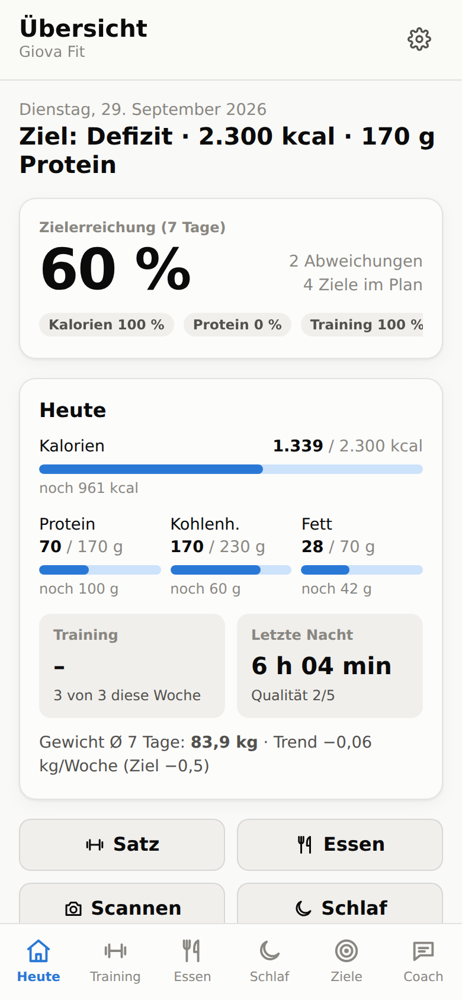
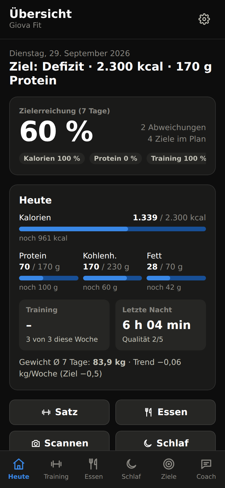

# Giova Fit

Trainings-, Ernährungs- und Schlaftracker mit KI-Coach (Claude Sonnet 5.5). Läuft als Web-App (PWA) im Browser und lässt sich auf dem Handy wie eine App installieren.

<p>
  
  
</p>

## Funktionen

- **Training:** Übung, Gewicht und Wiederholungen pro Satz eintragen (große +/– Tasten fürs Gym). Die App zeigt, was du letztes Mal geschafft hast, schlägt die nächste Steigerung vor und erkennt neue Rekorde. Für jede Übung wird der Verlauf bewertet (geschätztes 1RM, Trend pro Woche, Stufen *Starker Fortschritt / Fortschritt / Stagnation / Rückgang*). Dazu gibt es Wochenvolumen und Sätze pro Muskelgruppe.
- **Ernährung:** Tagebuch mit Kalorien, Protein, Kohlenhydraten und Fett je Mahlzeit. Nährwerttabellen **fotografieren**: Claude liest die Werte aus, und Foto samt Werten landen in deiner Lebensmittel-Bibliothek.
- **Schlaf:** Zubettgeh- und Aufstehzeit plus Qualität. Ausgewertet werden Durchschnitt, Schlafdefizit und Regelmäßigkeit.
- **Ziele:** Defizit, Erhalt, Aufbau, Kraftgewinn oder Rekomposition, dazu Kalorien- und Makroziele (auf Wunsch automatisch berechnet), Wunsch-Gewichtsänderung, Schlaf- und Trainingsziel sowie Kraftziele mit Termin. Das Körpergewicht wird mit 7-Tage-Durchschnitt und Trend erfasst.
- **Zielabgleich:** Deine Werte werden laufend mit deinen Zielen verglichen. Bei Abweichungen bekommst du konkrete Anweisungen, zum Beispiel „Reduziere um ca. 500 kcal/Tag“, „+60 g Protein“ oder „gegen 22:45 ins Bett“. Außerdem schätzt die App deinen echten Kalorienverbrauch aus Essen und Gewichtsverlauf.
- **Zusammenhänge:** Deine Trainingsleistung wird mit Schlaf, Kalorien vom Vortag und Protein verknüpft („Nach ≥ 7 h Schlaf warst du im Schnitt 1,7 % stärker“).
- **KI-Coach (Claude Sonnet 5.5):** Der Chat kennt deine Ziele und Daten und rechnet Kombinationen mehrerer Lebensmittel exakt aus, bevorzugt aus deiner Bibliothek. Er schlägt Mahlzeiten passend zu den offenen Makros vor und kann Essen direkt eintragen. Auf Knopfdruck erstellt er außerdem eine ausführliche Analyse mit Änderungsvorschlägen.

## Starten

```bash
npm install
npm run dev        # Entwicklungsserver
npm test           # Unit-Tests der Analyse-Logik
npm run build      # Produktions-Build nach dist/
```

**Auf dem Handy nutzen:** Der Workflow `.github/workflows/deploy.yml` veröffentlicht die App bei jedem Push auf `main` auf GitHub Pages. Dafür einmalig im Repo unter *Settings → Pages → Source* „GitHub Actions“ auswählen. Danach die Seite im Handy-Browser öffnen und „Zum Startbildschirm hinzufügen“ wählen.

## KI einrichten

Foto-Erkennung, Chat und Analyse brauchen einen Claude-API-Schlüssel von [console.anthropic.com](https://console.anthropic.com/settings/keys). Trag ihn in der App unter ⚙︎ → *Claude API-Schlüssel* ein.

- Der Schlüssel liegt nur lokal im Browser, und die App ruft die Anthropic-API direkt auf. Leg in der Anthropic-Konsole am besten ein Ausgabenlimit fest.
- Lehnt Sonnet 5.5 eine Anfrage aus Sicherheitsgründen ab, versucht die API automatisch ein Ersatzmodell (`fallbacks: "default"`).
- Ohne Schlüssel funktioniert alles andere trotzdem. Beim Foto trägst du die Werte dann selbst ein, das Bild wird aber gespeichert.

## Daten

Alle Daten (inkl. Fotos) liegen in IndexedDB auf deinem Gerät. Unter ⚙︎ → *Daten & Sicherung* kannst du eine JSON-Sicherung exportieren und wieder importieren, etwa für einen Handywechsel.

## Aufbau

| Pfad | Inhalt |
|---|---|
| `src/lib/` | Reine Logik: 1RM/Trends, Ernährung, Schlaf, Gewicht, Zielberechnung, Zielabgleich (`analysis.ts`), Tests |
| `src/ai/` | Claude-Anbindung: Foto-Auslesen (`labelScan.ts`), Chat mit Werkzeugen (`chat.ts`, `tools.ts`), Coach-Analyse (`coach.ts`) |
| `src/views/` | Bildschirme: Heute, Training, Essen, Schlaf, Ziele, Coach, Einstellungen |
| `src/components/` | UI-Bausteine, Diagramme, Foto-Scanner, Lebensmittel-Bibliothek |

Keine medizinische Beratung. Bei Schmerzen, Verletzungen oder gesundheitlichen Fragen ärztlichen Rat einholen.
